# Lancy Housekeeping Simulator: Scenarios & Timeline States

This document serves as the single source of truth for all operational states, housekeeper shifts, master timeline data, and simulation scenarios built into the Lancy AI Housekeeping Engine.

---

## 1. Master Housekeeper Schedules & Arrivals

Each housekeeper clocks in at a specific, designated time. The system's conversational intelligence is dynamically aware of who has arrived based on the current simulation time.

### Attendant Arrival Matrix
| Housekeeper | Initials | Language | Shift Start Time | Assigned Rooms Queue |
| :--- | :--- | :--- | :--- | :--- |
| **James** | JO | English | **07:12 AM** | 302, 303, 304 |
| **Ana** | AG | English | **07:30 AM** | 201, 202, 203, 502 |
| **Priya** | PS | Hindi | **07:45 AM** | 305, 401, 402, 405 |
| **Rosa** | RM | Spanish | **07:53 AM** | 204, 205, 301, 404 |
| **Sofia** | SC | English | **08:15 AM** | 403, 503, 505 |

---

## 2. Baseline Hotel Inventory (20 Rooms)

The hotel comprises 20 rooms across 4 floors. By default, 18 rooms are occupied by staying/departing guests, and 2 rooms are clean and empty.

*   **Clean Empty Rooms**: Room **501** (Standard) and Room **504** (Deluxe) are ready for check-ins.
*   **Checkout Rooms (15 Rooms)**: 201, 202, 203, 204, 205, 301, 302, 303, 304, 305, 401, 402, 403, 503, 505.
*   **Stayover / Continuing Rooms (3 Rooms)**: 404 (Deluxe), 405 (Suite), 502 (Standard).

---

## 3. Master Simulation Timeline & Operational Scenarios

The simulator progresses through distinct temporal states, introducing automated operational challenges and reviews.

```mermaid
gantt
    title Lancy Shift Timeline & Scenario Sequence
    dateFormat  HH:mm
    axisFormat %H:%M
    
    section Housekeeper Arrivals
    James Starts (07:12)   :a1, 07:12, 10m
    Ana Starts (07:30)     :a2, 07:30, 10m
    Priya Starts (07:45)   :a3, 07:45, 10m
    Rosa Starts (07:53)    :a4, 07:53, 10m
    Sofia Starts (08:15)   :a5, 08:15, 10m

    section Major Events
    Shift Startup & 3 Early Checkouts (08:00) :e1, 08:00, 10m
    First Room Reviews Pending (10:00)       :e2, 10:00, 10m
    Scenario A: 204 Broken Mirror (10:10)    :e3, 10:10, 10m
    Scenario B: 303 TV Broken (11:15)        :e4, 11:15, 10m
    Scenario C: 402 Plumbing Leak (12:17)    :e5, 12:17, 10m
```

### ⏰ State A: 08:00 AM — Shift Startup & Early Checkouts
At shift start, exactly 3 rooms check out early: **Room 201, Room 204, and Room 302**.
*   **Active Arrivals Count**: James (07:12), Ana (07:30), Priya (07:45), and Rosa (07:53) have arrived and clocked in. Sofia (08:15) is expected later.
*   **Room States**:
    *   Rooms `201`, `204`, and `302` instantly trigger a `DIRTY` status.
    *   All other stayover/checkout rooms remain occupied/clean-empty.
*   **Lancy Dialog**: Triggers morning greeting ("Good morning Marcus. Here is today at Maplewood Suites. 15 rooms checking out at 10:00 AM. 17 guests arriving by 1:00 PM. 5 housekeepers ready. Shall I generate the room cleaning assignments?") and offers suggested button `[Yes, assign rooms]`.

### ⏰ State B: 10:00 AM — First Reviews Pending & Queue Rushes
By 10:00 AM, all remaining checkout guests have left. Rooms trigger `DIRTY` and housekeepers are actively working.
*   **Active Arrivals Count**: All 5 housekeepers are clocked in and active.
*   **Supervisor Review Queue**:
    *   **Room 201** is completed by Ana and awaiting review (Review pending since 10:40 AM in standard simulation speed, or 10:00 AM timeline step).
    *   **Room 302** is completed by James and awaiting review.
    *   **Room 403** is completed by Sofia and awaiting review.
*   **Lancy Dialog**: Lancy alerts Marcus to review Rooms 201, 302, and 403.

### ⏰ State C: 10:10 AM — Scenario A: Guest Damage
*   **Event**: Rosa is cleaning **Room 204** and reports physical damage: a broken bathroom mirror.
*   **Lancy UI Card**: Injects a warning bubble: *"🚨 Room 204 Guest Damage: Rosa reported guest damage in Room 204 (broken mirror). I have notified the front desk. Charge will be applied to the departing guest's bill automatically."*

### ⏰ State D: 11:15 AM — Scenario B: Minor TV Issue
*   **Event**: James is cleaning **Room 303** and reports that the guest television is not turning on.
*   **Lancy UI Card**: Injects an interactive option card: *"🔧 Minor Issue · Room 303: James reports the TV is not functioning in Room 303. Do you want to continue cleaning or pause for maintenance?"*
*   **Action Choices**:
    *   *Tap "Continue Cleaning"*: Logs a maintenance ticket and directs James to finish.
    *   *Tap "Pause"*: Pauses turnover and flags room.

### ⏰ State E: 12:17 PM — Scenario C: Major Plumbing Leak
*   **Event**: Priya is inspecting/cleaning **Room 402** and reports an active, severe plumbing leak flooding the bathroom floor.
*   **Lancy UI Card**: Injects an urgent alert: *"🚨 URGENT: Major Plumbing Issue: Priya reports the bathroom is actively leaking in Room 402. Block room from inventory?"*
*   **Action Choices**:
    *   *Tap "Stop & Block Room"*: Room 402 status transitions to **Blocked**, removing it from the active inventory. Priya is dynamically reassigned to **Room 405** (Suite) to resume her sequence.
    *   *Blocked State*: The card updates to reflect: *"✅ Room 402 is BLOCKED and out of inventory. Reception has been alerted to reassign guests."*

### ⏰ State F: 01:00 PM — Shift Wrap-up & Empty Arrivals
*   **Event**: The two clean empty rooms receive incoming arrivals.
*   **Room States**: Rooms **501** and **504** transition to `OCCUPIED` status. All other completed rooms transition to `READY`.
